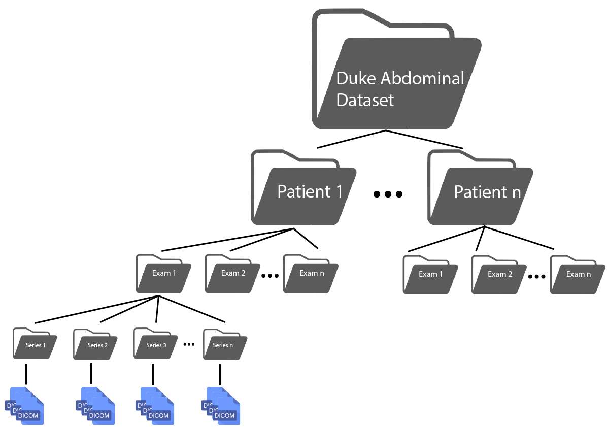
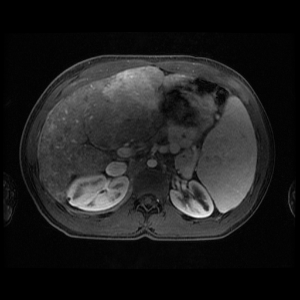

# Duke Abdominal MRI Series Dataset
This dataset contains abdominal MRI series for 105 patients, who underwent MRI examination  at  Duke  University  Hospital.   For  each  patient  there  is  exactly  1examination, and for each examination there are tens of series.  In each series,there are also tens of MRI slices (stored as dicom format file).  An illustration of the hierarchy of the dataset is shown in the figure below. 

## Series Types
We provide all the 30 series types in the following table. In each cell the format is *series type*(*numeric label*).
|  |  |   |   |  |
|--------------------------------------------|---------------------------------|-------------------------|--------------------|----------------|
| Coronal Precontrast Fat Suppressed T1w(24) | Coronal Late Dynamic T1w(6)     | Venous Subtraction(29)  | Anythingelse(1)    | Axial T2w(9)   |
| Coronal Transitional/ Hepatocyte T1w(13)   | Axial Late Dynamic T1w(16)      | Portal Venous T1w(23)   | Arterial T1w(2)    | Fat Only(11)   |
| Coronal Steady State Free Precession(28)   | Proton Density Fat Fraction(21) | Coronal In Phase(15)    | Axial In Phase(14) | Axial ADC(0)   |
| Axial Precontrast Fat Suppressed T1w(25)   | Water Density Fat Fraction(22)  | Early Arterial T1w(3)   | Coronal T2w(7)     | Localizers(17) |
| Axial Transitional/ Hepatocyte T1w(12)     | Axial Opposed Phase(19)         | Late Arterial T1w(4)    | Axial DWI(8)       | MRCP(18)       |
| Axial Steady State Free Precession(27)     | Coronal Opposed Phase(20)       | Arterial Subtraction(5) | Coronal DWI(10)    | R2*(26)        |

## Deidentification
This dataset has been deidentified before publication, which means it contains no PHI.

## Dataset Tutorial
###Dependencies
* tensorflow
* opencv-python
* pydicom
The version of the libraries we tested are: tensorflow 1.15.0, opencv 4.2.0.32 and pydicom 1.4.2. You can install those by:
```
pip install tensorflow-gpu==1.15 
pip install opencv-python==4.2.0.32
pip install pydicom==1.4.2
```
### Classifying an anonymized slice using pretrained Google Inception 2D model.
A pretrained model (checkpoint) is in the 0621 directory.
The test image is an anonymized abdominal liver MRI:


Then you can run inception_2d_test.py and the script will output:
```
Predicted Series Type: arterial
Probability: 0.718601822853
```
### Training a abdominal series classifier using this dataset
Since the whole dataset is about 20GB, loading it to the memory is infeasible for a typical PC. We train the model using tensorflow *Estimator*
and convert the images and labels into tfrecord format, so that during training when a batch is needed it can be loaded efficiently. Note that for 
demonstration purpose we only adopt a 2D model for simplicity.
#### Preparing the tfrecord
First, you need to change to directories in the *construct_tfrecord_2d.py*. In line 83 change *dataset_folder* to the directory where you
put the dataset, and in line 85 
change the *output_folder* to the directory where you would like the generated file to store. After these two values are set, you can just
run the script.

#### Training an abdominal series classifier
Run the *inception_2d_train.py* with three arguments: *tfrecord_folder*, *logdir* and *steps*. *tfrecord_folder* is the directory where you put your 
generated tfrecord, *logdir* is the place where you want to save the training information (models, losses, etc), and *steps* is the number of steps in
training process. Here is an example:
```
python inception_2d_train.py /mnt/sdc/dataset/tf/2d /mnt/sdc/dataset/tmp/2d_inception_model 50000
```
Then you should see something like this:
```
INFO:tensorflow:Running local_init_op.
INFO:tensorflow:Done running local_init_op.
INFO:tensorflow:Saving checkpoints for 0 into /mnt/sdc/dataset/tmp/2d_inception_model/model.ckpt.
INFO:tensorflow:loss = 3.7707667, step = 1
INFO:tensorflow:accuracy = 0.03125, global_step = 1, loss = 3.7707667, my_acc = 0.03125
...
```
Typically you need to wait a few hours until the training stops.
## Download
The dataset can be download from **here**(coming soon).

## Citation
If you find this dataset is useful, please cite our paper:
```
3D Pyramid Pooling Network for Liver MRI Series Classification.
Zhe Zhu, Amber Mittendorf, Erin Shropshire, Brian Allen, Chad Miller, Mustafa R. Bashir, and Maciej A. Mazurowski, 
IEEE Transactions on Pattern Analysis and Machine Intelligence.
```


## Contact
Please contact Zhe Zhu(zhe.zhu@duke.edu) if you have any question about this dataset.
